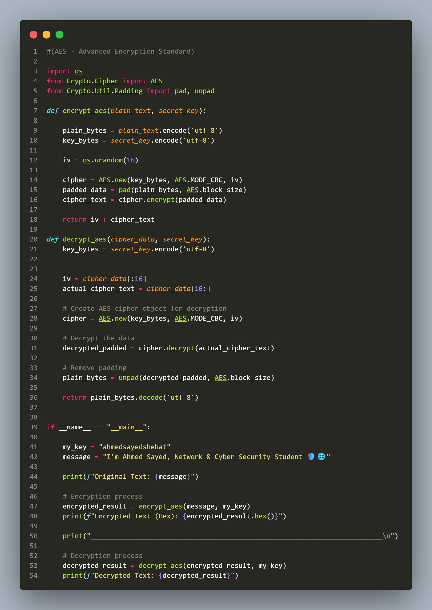
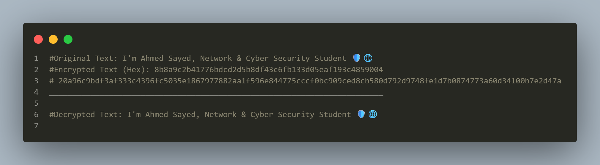

# AES-128 Encryption & Decryption System

A secure, high-performance implementation of the **Advanced Encryption Standard (AES)** in **CBC (Cipher Block Chaining) Mode** using Python. Designed to demonstrate the core cryptographic principles of modern data security.

---

## 🚀 Overview
This repository contains a fully functional implementation of AES-128. It showcases how data can be securely encrypted and decrypted using a symmetric key, utilizing dynamic Initialization Vectors (IV) to prevent pattern analysis attacks and ensure maximum cryptographic entropy.

---

## 📊 Visuals & Output

### 🛠️ Source Code Snippet
Here is the structured layout of the implementation:



### 🖥️ Execution Result
The following output confirms successful padding, encryption (outputted in hexadecimal format), and error-free decryption:



---

## 🧠 How AES Works Behind the Scenes

AES does not rely on a simple single equation; instead, it processes data through a $4 \times 4$ matrix of bytes known as the **State Array**. For **AES-128**, the data undergoes **10 mathematical rounds**. 

Each round undergoes 4 distinct, highly calculated operations to maintain security:

1. **SubBytes (Substitution):**
   - **What happens:** Every single byte in the matrix is replaced with another byte from a predefined static table called the **S-Box**.
   - **Purpose:** Introduces **Non-linearity**, making it mathematically impossible to establish a simple linear relationship between the plaintext and ciphertext.

2. **ShiftRows (Permutation):**
   - **What happens:** Rows of the matrix are shifted cyclically to the left by varying offsets (Row 0: no shift, Row 1: 1 byte, Row 2: 2 bytes, Row 3: 3 bytes).
   - **Purpose:** Mixes data horizontally, spreading byte dependencies across rows.

3. **MixColumns (Diffusion):**
   - **What happens:** Each column of the state array is multiplied by a fixed matrix using advanced matrix multiplication over **Galois Fields ($GF(2^8)$)**.
   - **Purpose:** Provides intense **Diffusion**. Changing a single bit in the plaintext alters entire columns in the ciphertext, making pattern recognition impossible.

4. **AddRoundKey:**
   - **What happens:** The current state matrix is combined with a sub-key derived from the main secret key using a bitwise **XOR** operation.
   - **Purpose:** Tightly binds the cryptographic secret key to the data at every stage of execution.

---

## 🛠️ Requirements & Usage

### Installation
Make sure you have the standard cryptographic extension installed:
```bash
pip install pycryptodome
